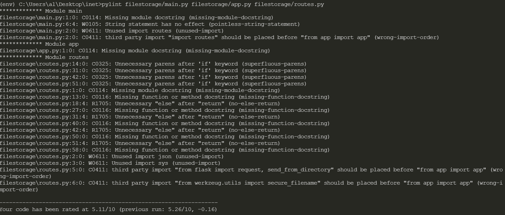
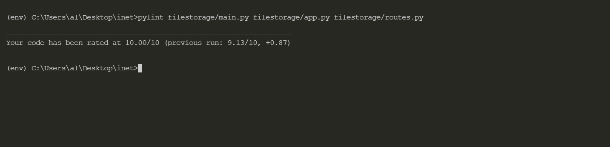
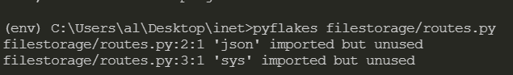
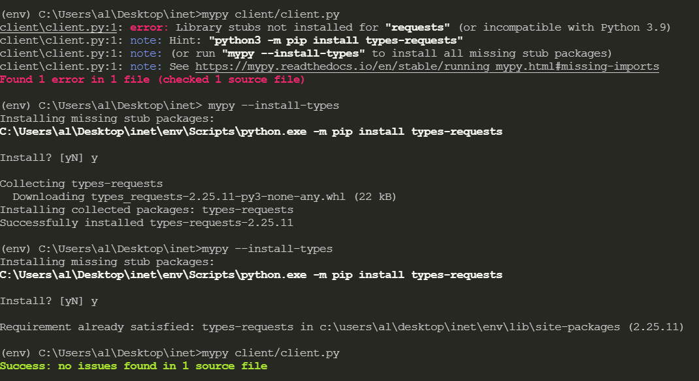

# Лабораторная 5 
В качестве одного из инструментов статического анализа был выбран *Pylint* 

модули для анализа - app.py, main.py, routes.py из лабороторной №3.
Основные ошибки:
* неправильный порядок импортов
* отсутствие докстрингов
* неиспользуемые импорты
* использование else после return

Удалось все поправить

Следующий инструмент *pyflalkes*

Сообщил о неиспользуемых импортах, убрал их

Потом я использовать *pymy*

Он посоветовал установить стабы

